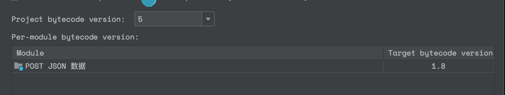
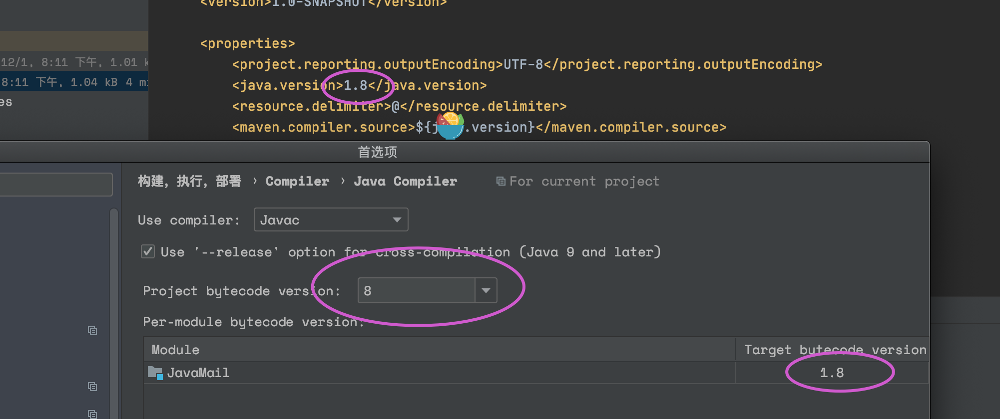
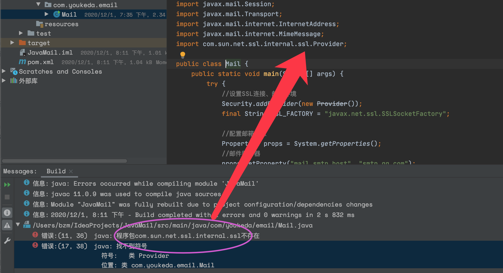
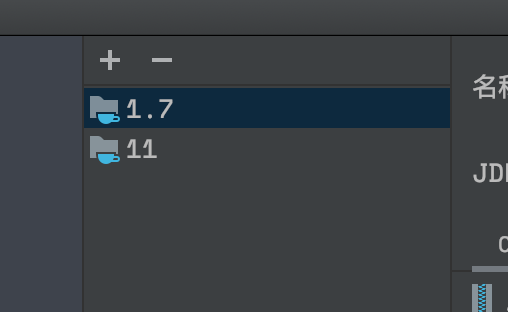
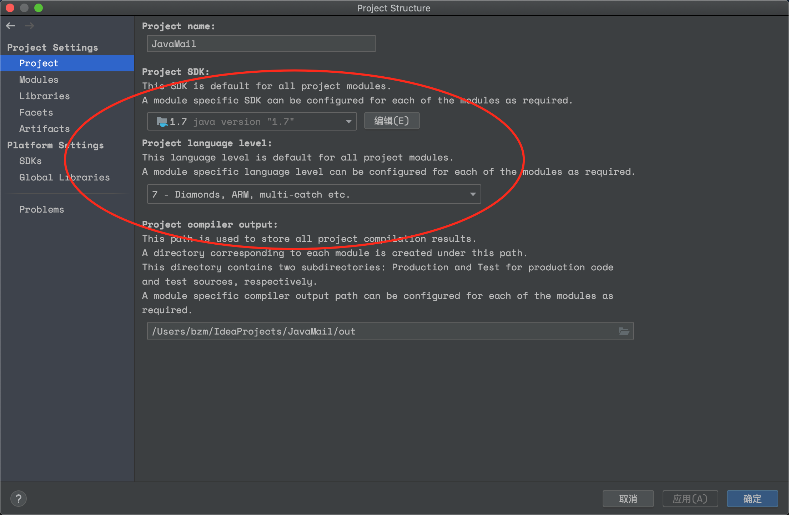
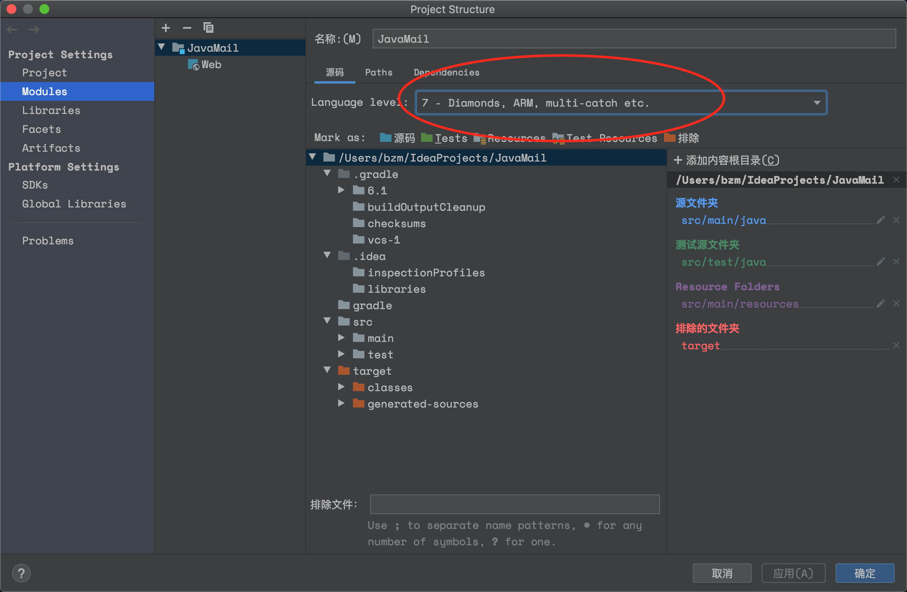
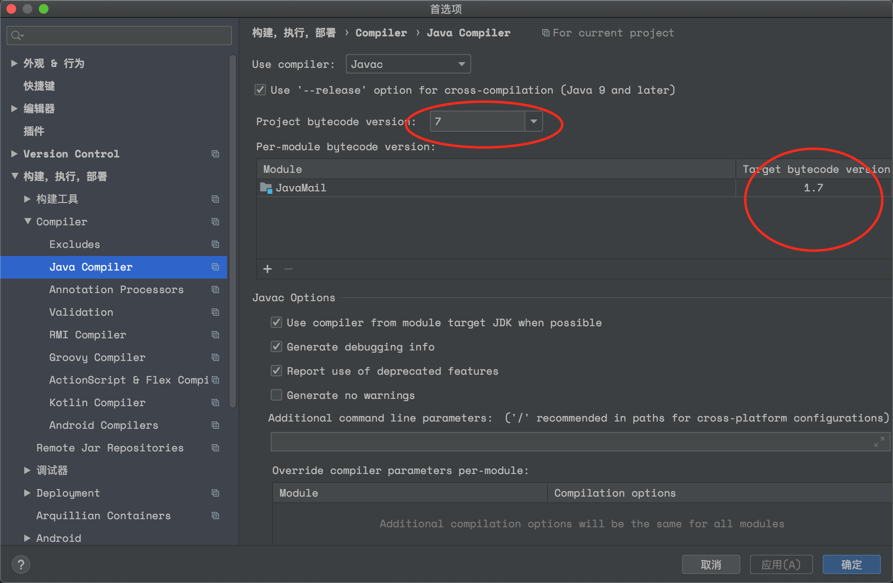

# 1.xml错误

右键文件夹➡️添加框架的支持➡️maven

不行？ pom.xml添加一个groupID

不行？偏好设置➡️构建，执行，部署➡️Compiler➡️Java Compiler➡️

如上图，project bytecode version修改成5试试，应该就好了，不行的话改成别的数字（反正要满足等于自己的JDK）

第二天搞javax.mail时又出错了，改成这样倒是可以了⬇️

# 2.javax.mail错误

需要去oracle下载包

然后我把pom.xml的javax.mail版本号改为与新下载的一样，但是构建后还是无法找到

然后才发现右边弹出一个蓝色正方形M,点击后就可以了。

不过出现了这个

第二天，我下载完jdk-7u80(即jdk7的某一具体版本)，打开文件-项目结构，添加下载好的1.7

然后在这里改成这样（第一行11改成1.7）

这里也改成7

最后再是这里

和这里

然后按下运行，ok！

